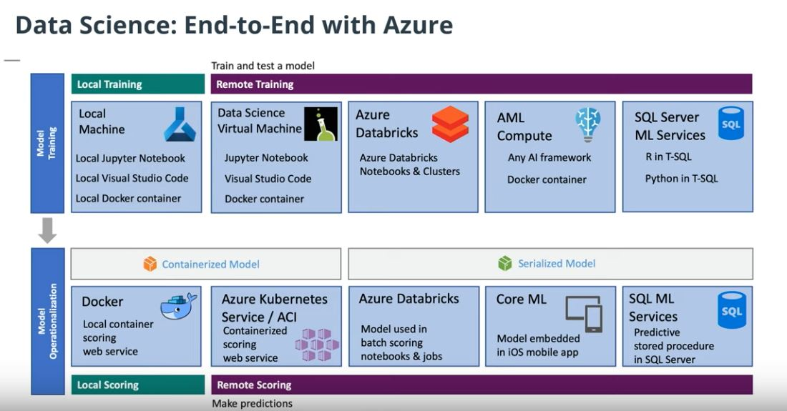
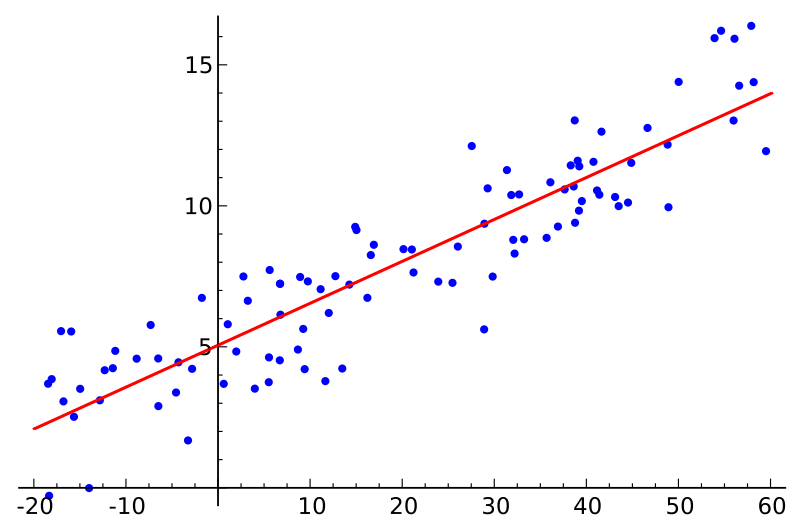

- [What is ML](#what-is-ml)
- [Applications of Machine Learning](#applications-of-machine-learning)
- [Brief history of ML](#brief-history-of-ml)
- [The Data Science Process](#the-data-science-process)
- [Common Types of Data](#common-types-of-data)
  - [Tabular Data](#tabular-data)
  - [Scaling continuous data](#scaling-continuous-data)
  - [Vectorizing non-numerical data](#vectorizing-non-numerical-data)
    - [Categorical data](#categorical-data)
    - [Image data](#image-data)
    - [Text data](#text-data)
      - [Normalization](#normalization)
      - [Vectorization a.k.a. Feature extraction](#vectorization-aka-feature-extraction)
        - [TF-IDF](#tf-idf)
        - [Word embedding](#word-embedding)
      - [Finding features in text](#finding-features-in-text)
- [Computer science vs. Statistical perspective](#computer-science-vs-statistical-perspective)
- [The Machine Learning Ecosystem](#the-machine-learning-ecosystem)
  - [Libraries](#libraries)
  - [Development environments.](#development-environments)
  - [Cloud services](#cloud-services)
  - [End to end with Azure](#end-to-end-with-azure)
- [Models and algorithms](#models-and-algorithms)
  - [Linear regression](#linear-regression)
    - [Simple Linear Regression](#simple-linear-regression)
    - [Multiple Linear Regression](#multiple-linear-regression)
    - [Training a Linear Regression Model](#training-a-linear-regression-model)
      - [The Cost Function](#the-cost-function)
      - [Data assumptions to respect](#data-assumptions-to-respect)
  - [Learning a function](#learning-a-function)
    - [Irreducible error vs model error](#irreducible-error-vs-model-error)
  - [Algorithm's types](#algorithms-types)
    - [Parametric vs Non-parametric](#parametric-vs-non-parametric)
    - [Deep learning vs classical ML](#deep-learning-vs-classical-ml)
- [Approaches to Machine Learning](#approaches-to-machine-learning)
- [ML trade-Offs](#ml-trade-offs)
  - [Bias vs. Variance](#bias-vs-variance)
  - [Overfitting vs. Underfitting](#overfitting-vs-underfitting)
- [Resources:](#resources)

# What is ML

Classic definition:

> Machine learning is a data science technique used to extract patterns from data, allowing computers to identify related data, and forecast future outcomes, behaviors, and trends.

ML vs traditional programming

| Traditional programming  |  ML | 
|:-:|:-:|
| Input: rules and data  | Input: historical data and answers  | 
| Output: answers  |  Output: rules |
| Limitations: we might not always come up with the set of appropriate rules  |   |

ML is best suited for:

* pattern recognition
* anomaly detection
* forecasting
* recommendations
* time series

# Applications of Machine Learning

Common applications of ML:

1. Natural language processing (NLP):
   * text (topic detection, summarization, similarity search)
   * speech (sppech to text, text to speech, translation)
2. Computer vision: self-driving cars, objects detection and identification, LIDAR
3. Analytics: regression, classification, forecasting, clustering.
4. Decision making: recommendations, sequential decision making.

# Brief history of ML

Beginning AI at 1950s -> ML 1980s -> Deep Learning 2010s

AI - machines thinking like humans
ML - subcategory of AI, learning from data without being specifically programmed
Deep Learning - subcategory of ML, usage of neural-network architecture 

# The Data Science Process

1. Collect data:
   * retrieve files
   * query SQL databases
   * call web services
   * scrape web pages
2. Prepare Data - Transform the data in a format suitable for analysis, identify or create features needed for our model:
  * explore data
  * validate data
  * clean data
  * featurize data
3. Train the model: 
  * prepare training set and validation data set
  * experiment - select an algorithm, identify the best performing version of the model
  * test model
  * visualize performance, sanity check the outcome
4. Evaluate model: run if through the validation dataset :
  * test performance
  * compare models
  * validate model
  * visualize performance
5. Deploy the model: access it through API, evaluate ongoing performance of the model:
  * export model file
  * prepare job
  * deploy container
  * re-package model
6. Retain the model in production as new data arrives 

# Common Types of Data

| Type  |  Desciption | Example | 
|:-:|:-:|:-:|
| numeric  |  integer, float | price |
| time-series  |  series of numerical values that can be ordered (desciminator: time, location, ...) | price evolution, market stock value |
| category  |  discrete and limited set of values, most of the features are of this type | gender, location |
| text | words, sentences | article |
| image | | videos, pictures |

Every data ends up being numerical in Data Science for an algorithm to be able to process it.

## Tabular Data

Th most common type of data organization in ML is tabular data. 
In tabular data, each row describes a single item (an observation) of some domain, while each column describes distinct property (feature) of the item.

Feature value can be discrete(categorical) or continuous.

Categorical data (color, gender) end up being represented as numbers.

Continuous data (quantity, price) is often scaled. Scaling data means *transforming* it so that the values fit within some range or scale, such as 0–100 or 0–1. Scaling can speed up the training process, since the algorithm only needs to handle numbers less than or equal to 1.

Each row of input tabular data is transformed into a vector (an array of numbers, array of arrays).
Mathemathical domain which deals with calculation on vectors is linear algebra.

## Scaling continuous data

There are two common approaches to scaling data:
* standardization - rescales data so that it has a mean of 0 and a standard deviation of 1: 
  > *(𝑥 − 𝜇)/𝜎*
* normalization - rescales the data into the range [0, 1]:
  > *(𝑥 −𝑥𝑚𝑖𝑛)/(𝑥𝑚𝑎𝑥 −𝑥𝑚𝑖𝑛)*

## Vectorizing non-numerical data

### Categorical data

There are two approaches for encoding categorical data:
* ordinal encoding  - converting the categorical data into integer codes ranging from 0 to (number of categories – 1).
  * drawback: "ordering" categories, making them less or more imporant depending on the order
* one hot encoding - transforming each category into a column. If an item belongs to a category, there is an 1 in the cell, 0 otherwise.
  * drawback: it can potentially generate a very large number of columns.

### Image data 

Image consists of pixels.
Each pixel can be encoded using the following dimensions:
* height pixel position
* width pixel position
* pixel color depth

Color depth is a number of color channels to represent a value of the color:
* grayscale image: ony 1 channel, with values from 0 to 255.
  * a vector describing a grayscale image has 2 dimentions, since there is only 1 depth
* RGB: 3 channels Reg, Green, Blue each with values from 0 to 255
  * a vector describing a GRB image has 3 dimentions: height,width, depth (channel)

The size of a vector to encode 1 image is height*width*depth.
For example for a square grayscale image of 9 pixels:
| 1   5   6  |
| 45  0  255 | => 1, 5, 6, 45, 0, 255, 4, 8, 7 
| 4  78   7  |

For more information, see [bitmap](https://en.wikipedia.org/wiki/BMP_file_format) image encoding.

Image preprocessing results in:
1. ensure that all the input images have a uniform aspect ratio (most commonly square)
2. encode image
3. normalize data (subtract mean pixel value in a channel from each pixel value in that channel)

### Text data
#### Normalization
Text encoding start with *tokenization*: each piece of text is split into smaller pieces - tokens. Each token is simply a word.

One of the challenges to encode text is that the same meaning can be represented with different forms. For example: to be, am, is, are.

To be able to encode text one needs to normalize it, i.e. represent the text in a canonical (official) form.

Example of normalization is *lemmatization*. Lemmatization consists of replacing each word by a corresponding lemma. Lemma is the dictionary from of a word.
For example: is -> be, are -> be, am -> be.

Further processing is removing *stop words*. Stop words are high-frequency words that are unnecessary (or unwanted) during the analysis.

#### Vectorization a.k.a. Feature extraction

Common approaches to encode normalized text into a vector include:
* [Term Frequency-Inverse Document Frequency (TF-IDF)](https://en.wikipedia.org/wiki/Tf-idf) vectorization
* Word embedding, as done with [Word2vec](https://en.wikipedia.org/wiki/Word2vec) or [Global Vectors (GloVe)](https://nlp.stanford.edu/pubs/glove.pdf)

[Extracting and serving feature embeddings for machine learning](https://cloud.google.com/solutions/machine-learning/overview-extracting-and-serving-feature-embeddings-for-machine-learning)

##### TF-IDF
Each word has an "importance" weight.
We select a set of words base on which we want to analyse the text. The number of words in this set give a vector length. In other words, each important word becomes a feature.
Each chunk of text is represented by a vector: if an important word id encountered, there is a weight value of this word in a cell, 0 otherwise.

##### Word embedding

Each word is mapped to a vector.

#### Finding features in text

Vector is a line in N-dimentional space. Any vector with the same length can be visualized in the same space.
How close one vector is to another can be calculated as *vector distance*. If two vectors are close to each other, we can say the text represented by the two vectors have a *similar meaning or have some connections*. 

Text preprocessing results in:
1. Normalization:
   1. tokenization
   2. lemmatization
   3. removing stop words
2. Feature extraction (vectorization)

# Computer science vs. Statistical perspective

One will often see the same underlying ML concepts described using different terms.

|| computer science  |  staticstics | 
|:-:|:-:|:-:|
| input | features | independent variables |
| result | program that generates desired output | function that predicts the values of the dependent variables |
|| Output = Program(Input Features) | Dependent Variable = f(Independent Variables), Y = F(X) | 
| input item | row, entity, instance, vector | observation, vector (X1,X2, ..) |
| element of the input | column, attribute, feature | independent variable |

# The Machine Learning Ecosystem

## Libraries
A library is a collection of pre-written (and compiled) code, exposing some commonly used functionalities.

Popular data-science libraries/frameworks:
* [Scikit-Learn](https://scikit-learn.org) - is a python library, "Simple and efficient tools for predictive data analysis"
* [Keras](https://keras.io/) - is an open-source neural-network framework written in Python. It is capable of running on top of TensorFlow, Microsoft Cognitive Toolkit, R, Theano, or PlaidML. Keras was conceived to be an interface rather than a standalone machine learning framework. It offers a higher-level, more intuitive set of abstractions that make it easy to develop deep learning models regardless of the computational backend used.
* [Tensorflow](https://www.tensorflow.org/) - is a free and open-source software library for dataflow and differentiable programming across a range of tasks. It is a symbolic math library, and is also used for machine learning applications such as neural networks.
* [PyTorch](https://pytorch.org/) - is an open source machine learning framework that accelerates the path from research prototyping to production deployment

Core frameworks and tools for ML:
* [Python](https://www.python.org/) - high-level programming language, core language used for data science
* [Pandas](https://pandas.pydata.org/) - is an open-source Python library designed for analyzing and manipulating data: tabular data, time-series data.
* [NumPy](https://numpy.org/) - is a library ro work with large, multi-dimensional arrays of data, and has many high-level mathematical functions that can be used to perform operations on these arrays.
* Jupiter - typical environment used to work

Machine learning and deep learning:
* Scikit-Learn
* [Apache Spark](https://spark.apache.org/) - is an open-source analytics engine that is designed for cluster-computing and that is often used for large-scale data processing and big data.
* Tensorflow
* PyTorch 
* Keras

Visualization:
* plotly - is not itself a library, but rather a company that provides a number of different front-end tools for machine learning and data science—including an open source graphing library for Python
* seaborn -  is a Python library designed specifically for data visualization. It is based on matplotlib, but provides a more high-level interface and has additional features for making visualizations more attractive and informative.
* [matplotlib](https://matplotlib.org/) - is a Python library designed for plotting 2D visualizations. It can be used to produce graphs and other figures that are high quality and usable in professional publications. 
* [bokeh](https://bokeh.org/) - is an interactive data visualization library. In contrast to a library like matplotlib that generates a static image as its output, Bokeh generates visualizations in HTML and JavaScript. This allows for web-based visualizations that can have interactive features.

## Development environments.

A development environment is a software application (or sometimes a group of applications) that provide a whole suite of tools designed to help you (as the developer or machine learning engineer) build out your projects.

Notebooks are originally created as a documenting tool that others can use to reproduce experiments. Notebooks typically contain a combination of runnable code, output, formatted text, and visualizations. 

Notebooks:
* [Jupyter Notebooks](https://jupyter.org/) - Open-source tool that can combine code, markdown, and visualizations together in a single document.
* Azure Notebooks
* Azure Databricks - Data analytics platform, optimized for use with Microsoft cloud services
* R Markdown
* Apache Zeppelin

Environments:
* Visual studio - Microsoft's core development environment
* Visual studio code - A light-weight code editor from Microsoft

You can use Azure Data Science Virtual Machine, Azure Databricks, Azure Machine Learning Compute, or SQL server ML services to train and test models and use Azure Kubernetes to deploy models. 

## Cloud services

A cloud service is a service that offers *data storag*e* or *computing powe*r over the Internet. 

ML cloud services leaders:
* Google Cloud Services
* Microsoft Azure
* Amazon Web Services

Support for managing the *core assets* involved in ML process:
| Feature science  |  Description | 
|:-:|:-:| 	
| Datasets |	Define, version, and monitor datasets used in machine learning runs. |
| Experiments / Runs | Organize machine learning workloads and keep track of each task executed through the service. |
| Pipelines | Structured flows of tasks to model complex machine learning flows. |
| Models |	Model registry with support for versioning and deployment to production. |
| Endpoints |	Expose real-time endpoints for scoring as well as pipelines for advanced automation. |

Support for managing the *resources* required for running machine learning tasks:
| Feature science  |  Description | 
|:-:|:-:| 	
| Compute |	Manage compute resources used by machine learning tasks. |
| Environments |Templates for standardized environments used to create compute resources. |
| Datastores |Data sources connected to the service environment (e.g. blob stores, file shares, Data Lake stores, databases). |

*Azure ML workspace* features:
| Feature science  |  Description | 
|:-:|:-:|
| Automated ML |Automate intensive tasks that rapidly iterate over many combinations of algorithms, hyperparameters to find the best model based on the chosen metric. |
| Designer | A drag-and-drop tool that lets you create ML models without a single line of code. |
| Datasets | A place you can create datasets. |
| Experiments | A place that helps you organize your runs.
| Models | A place to save all the models created in Azure ML or trained outside of Azure ML.
| Endpoints | A place stores real-time endpoints for scoring and pipeline endpoints for advanced automation.
| Compute |	A designated compute resource where you run the training script or host the service deployment.
| Datastores |An attached storage account in which you can store datasets.

## End to end with Azure

Image [source](https://www.youtube.com/watch?time_continue=228&v=jj_06syZGEg&feature=emb_logo)

# Models and algorithms

Model is an output or a *specific* representation *learned from data*. A model represents what is learned by a machine learning algorithm on the data.
> Model=Algorithm(Data)

Algorithm is a *processes of learning*.

## Linear regression

Linear regression is an *algorithm* that uses a *straight line (or plane)* to describe relationships between variables. 
The core idea is to obtain a line, for which the total prediction error (the distance between the point to the line ) for all the points is the smallest possible.

### Simple Linear Regression

You may recall from fundamental algebra that the general equation for a line looks like this:

> y=mx + b, m - the slope of the line/coefficient, b - is the y-intercept (bias in ML).

In machine learning:
> y=B0​ + B1​∗x

### Multiple Linear Regression

In more complex cases where there is more than one input variable:

> y= B0 + B1∗x1 + B2∗x2 + B3∗x3...+Bn∗xn 

In this case, we are using multiple input variables to predict the output. The visualization of multiple linear regression is a *plane in multiple dimensions*.

### Training a Linear Regression Model

To "train a linear regression model" = to learn the *coefficients* and *bias* that best fit the data. 

#### The Cost Function

Cost function - the function calculating the error peoduced by the *model*.
The most commonly used cost function for linear regression is the root mean squared error ([RMSE](https://en.wikipedia.org/wiki/Root-mean-square_deviation)).

The RMSD of an estimator theta' with respect to an estimated parameter theta  is defined as the square root of the mean square error:

> RMSD = sqrt(MSE(theta'))=sqrt(E(theta'-theta )²))

For an unbiased estimator (error = 0), the RMSD is the square root of the variance, known as the [standard deviation](https://en.wikipedia.org/wiki/Standard_deviation).

#### Data assumptions to respect

Assumptions:
* *Linear relationship input <-> output* - relationship between input and output must be linear. Is not so, the data must be transformed. For example for exp relationship => use log transformation.
* *No collinearity in input* - having highly correlated input variables will make the model less consistent, one needs to perfoem correlation check among input variables.
* *Gaussian (normal) distribution of residual* -  the distance between output variables and real data (residual) is normally distributed. Id not so, the data must be transformed.
* *Perform rescaling* - linear regression is very sensitive to the distance among data points, so one must normalize or standardize the data.
* *No noise* - linear regression is very sensitive to noise and outliers in the data (it changes significantly the line learned), one must clean the data.

## Learning a function

 In essence, machine learning algorithms aim to learn a target function (f) that describes the mapping between data input variables (X) and an output variable (Y).
 Since the process extrapolates from a limited set of values, there will *always* be an error _e_ which is independent of the input data (X) such that:

> Y=f(X) + e

Error _e_ is called *irreducible* error because no matter how good we get at estimating the target function (f), we cannot reduce this error.

### Irreducible error vs model error

Irreducible error is caused by the data collection process (not enough data or not enough data features). In contrast, the model error measures how much the prediction made by the *model* is different from the true output. 

## Algorithm's types

### Parametric vs Non-parametric

Two classes of algorithms base on the *assumptions* about the *shape and structure of the function* they try to learn.
* Parametric - make assumptions about the mapping function and have a fixed number of parameters. 
  * Example: linear regression
* Non-parametric
  * Example: decision-tree

|| Parametric |  Non-parametric | 
|:-:|:-:|:-:|
| Benefits | Simpler, easier to understand and interpret the results | High flexibility (large number of functional forms)  | 
| | Fast learning | High performance |
| | Less training data required  |   |
| Limitations | Highly constrained to the specified form of the function assumed | More training data is required  |
| | Limited complexity of the problems  |  Slower to train, have far more parameters to train |
| | Poor fit in practice | Overfitting the training data is a risk |

### Deep learning vs classical ML

|| Deep learning |  classical ML | 
|:-:|:-:|:-:|
||Based on neural networks| Based on classical mathematical algorithms |
| Benefits | Suitable for high complexity problems | More suitable for small data  | 
| | Better accuracy | Easier to interpret outcomes |
| | Better support for big data  | Cheaper to perform (no large computational power needed) |
| | Complex features can be learned |
| Limitations | Opaque, difficult to explain trained data | Difficult to learn large datasets  |
| | Require significant computational power  |  Needs explicit feature engineering |
| |  |Difficult to learn complex functions |
  
    
# Approaches to Machine Learning

    
There are three main approaches to machine learning:

|Supervised learning| Unsupervised learning | Reinforcement learning | 
|:-|:-|:-|
| Learns both from inputs and expected outputs. | Learns from input data only. | Learns how an agent should take action in an environment in order to maximize a reward function.|
| Passive process. | Passive process. | Active process - the actions of the agent influence the data observed. Used in romotics, games, control theory, autonomous driving. |
| *Classification*: Outputs are categorical. For example span/not-spam | Clustering: Assigns entities to inherent groups. | Markov decision process: A mathematical process to model decision-making in situations where outcomes are partly random and partly under the control of a decision-maker. Does not assume knowledge of an exact mathematical model. |
| Feature learning: Features are learned from labeled data. Used to transform inputs into other inputs which are more relevant to solve a given problem.| Feature learning: Features are learned from unlabeled data.  | |
| Anomaly detection: classification of normal/abnormal. | Anomaly detection: Learns from unlabeled data, using the assumption that the majority of entities are normal.| |
| *Regression*: Outputs are continuous and numerical. For example a note of a student depending on hours spent. | | |
| Similarity learning: Learns from examples using a similarity function that measures how similar two objects are. Used in ranking, recommendation systems. | | |

# ML trade-Offs

The prediction error can be viewed as the sum of model error (error coming from the model) and the irreducible error (coming from data collection).

> prediction error = Bias error + variance + error + irreducible error

The goal of any *supervised* Ml algorithm is to acheve low bian and low variance.

Generally, increasing model complexity would decrease bias error since the model has more capacity to learn from the training data. But the variance error would increase if the model complexity increases, as the model may begin to learn from noise in the training data.

The goal of training machine learning models is to achieve low bias and low variance. The optimal model complexity is where bias error crosses with variance error.

## Bias vs. Variance
Bias measures how *inaccurate* the model prediction is in comparison with the true output.
Can be caused by inaccurate assumptions in order to simplify the model.
High model complexity tends to have a low bias.

Variance measures *how much the target function will change if different training data is used*. In other words the model is too sensitive to the new training data and changes much.
Can be caused by modeling the random noise in the training data. High model complexity tends to have a high variance.

As a general trend, parametric and linear algorithms often have high bias and low variance, whereas non-parametric and non-linear algorithms often have low bias and high variance.

Low bias = less assumptions about the form of the target function
High bias = more assumptions

Having more assumptions can potentially miss important relations between features and outputs and cause underfitting.

Low variance = changes in the training data -> small changes in prediction
High variance = changes in the training data -> large changes in prediction

High variance suggests that the algorithm learns the random noise instead of the output and causes overfitting.

## Overfitting vs. Underfitting

How sell the model generalizes from the training data to a new data.

*Overfitting* - models fit the training data very well, but fail to generalize to new data.

*Underfitting* - models neither fit the training data nor generalize to new data.
    
Limitting overfitting technics:
* Use re-sampling technique like [k-fold cross-validation](https://machinelearningmastery.com/k-fold-cross-validation/): splitting the initial training data into k subsets and train the model k times. In each training, it uses one subset as the testing data and the rest as training data.
* Hold back a *validation dataset* from the *initial training* data to estimatete how well the model generalizes on new data.
* Simplify the model. For example, using fewer layers or less neurons to make the neural network smaller.
* Reduce number of dimensions in training data such as [principal component analysis (PCA)](https://en.wikipedia.org/wiki/Principal_component_analysis).
* Use more data.
* Stop the training early: when the *performance* on the testing dataset *has not improved* after a number of training iterations.

# Resources:
* [Udacity Linear Algebra Refresher Course](https://www.udacity.com/course/linear-algebra-refresher-course--ud953).
* [Khanacademy liear algebra course](https://www.khanacademy.org/math/linear-algebra)
* [Keras Wiki article](https://en.wikipedia.org/wiki/Keras)
* [Machine Learning as a Service — The Top Cloud Platform and AI Vendors](https://medium.com/appanion/machine-learning-as-a-service-the-top-cloud-platform-and-ai-vendors-2df45d51374d) article by Tobias Bohnhoff.
* https://developers.google.com/machine-learning/crash-course/validation/another-partition
* https://towardsdatascience.com/understanding-the-bias-variance-tradeoff-165e6942b229